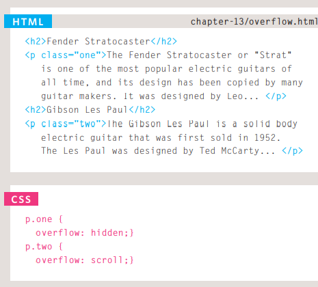
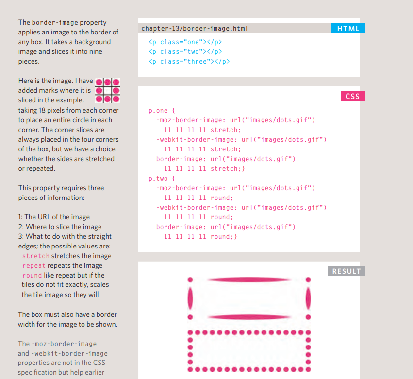

# HTML lists 
we have three types of lists in HTML 
1. **Ordered** lists are lists where each item in the list is numbered. For example, the list might be a set of steps for a recipe that must be performed in order, or a legal contract where each point needs to be identified by a section number.
2. **Unordered** lists are lists that begin with a bullet point (rather than characters that indicate order).
3. Definition lists are made up of a set of terms along with the definitions for each of those terms.

 ## Nested Lists 
 **we can put a second list inside an < li> element to create a sublist**
 
  
  # Boxes in HTML 
  why we use boxes in HTML files ?
  You can set several properties that affect the appearance of these boxes. In this chapter you will see how to:
* Control the dimensions of your boxes
* Create borders around boxes
* Set margins and padding for boxes
* Show and hide boxes
## boxes dimensions 
The most popular ways to specify the size of a box are to use pixels, percentages, or ems. Traditionally, pixels have been the most popular method because they allow designers to accurately control their size.

# Limiting Width (min-width, max-width)
what is the min and max-width ?
the min-width property specifies the smallest size a box can be displayed at when the browser window is narrow, and the max-width property indicates the maximum width a box can stretch to when the browser window is wide.

# Overflowing Content
The overflow property tells the browser what to do if the content 
contained within a box is larger than the box itself. It can have 
one of two values:
* **hidden** This property simply hides any extra content that does not fit in the box.
* **scroll** This property adds a scrollbar to the box so that users can scroll to see the missing content.

# Border, Margin & Padding

## why we use Margin and Padding 
**Margin** is used to seperate between elements 
**Pading** is used to adjust the element itself .

# Border and its Style 
* width of the border : it could be thin , medium or thick using border-width : thick 
or to specify it by using px method .
* Border style : it could be solid , dotted , dashed ,doubled, groove ,inset , ridge , outset or hidden/none.
by typing border-style: dashed 
* color : we can spicify each side of the border and select its color by typing : border-top-color : red
**we can write in a short hand : border : 3px dotted red ;**

# Padding 
The padding property allows you to specify how much space 
should appear between the content of an element and its 
border. 

# Margin 
The margin property controls the gap between boxes. Its value 
is commonly given in pixels, although you may also use 
percentages or ems.

# Border Imgs

.........................................................................
# JavaScript loops and Switch Statement 

# Switch Statement 

# Loops 
**there are three types of loops**
* For loop 
* while loop 
* Do while loop 

