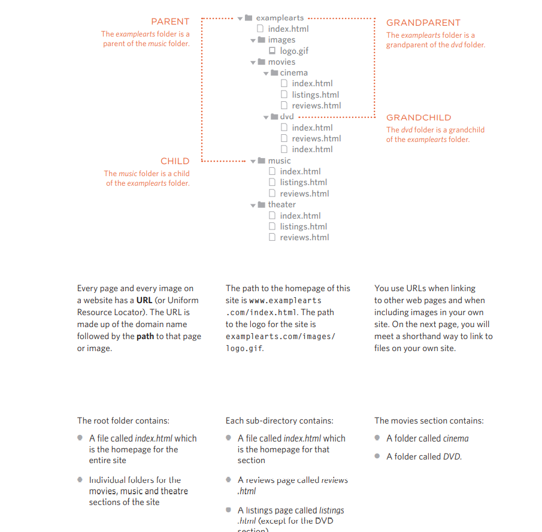
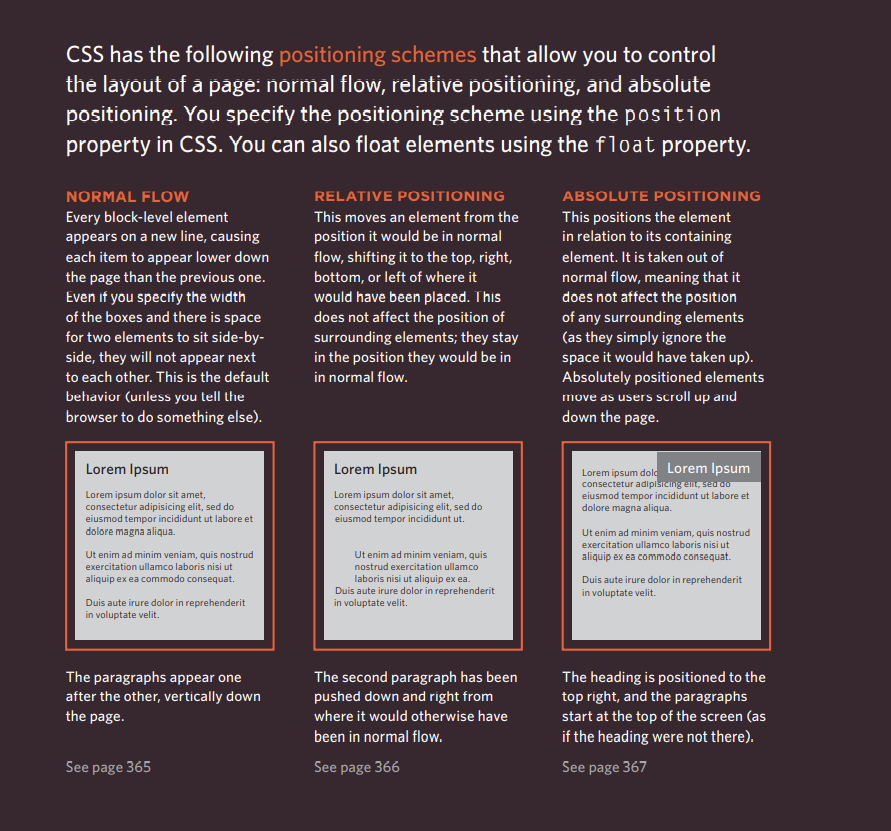
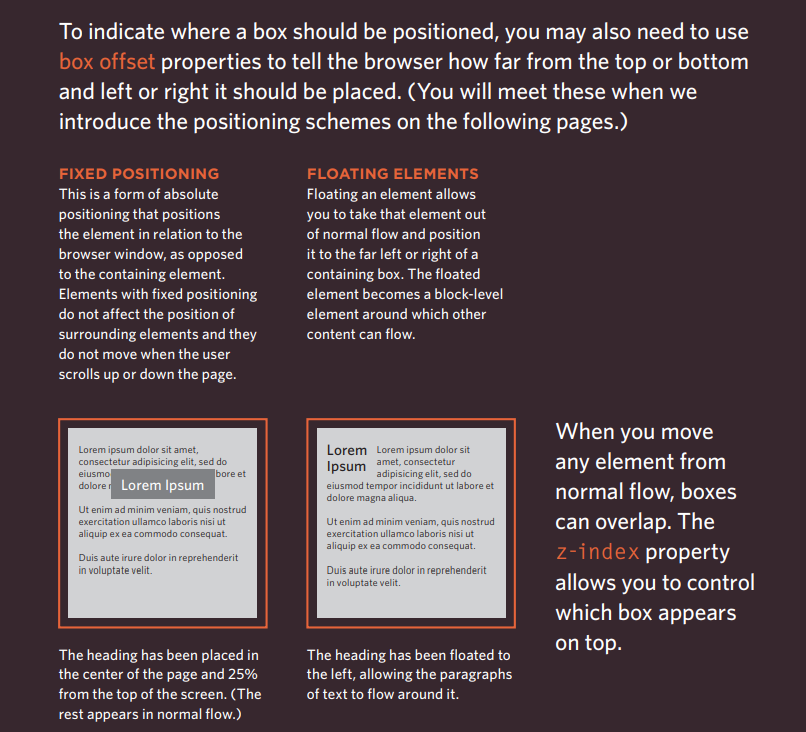

# HTML Links 
Links are the defining feature of the web because they allow you to move from 
one web page to another — enabling the very idea of browsing or surfing.
You will commonly come across the following types of links:

* Links from one website to another
* Links from one page to another on the same website
* Links from one part of a web page to another part of the 
same page
* Links that open in a new browser window
* Links that start up your email program and address a new 
email to someone

## Linking to Other Sites
When you link to a different website, the value of the href
attribute will be the full web address for the site, which is known as an absolute URL.
Browsers show links in blue with an underline by default.

## linking to other pages on the same site 
When you are linking to other pages within the same site, 
you do not need to specify the domain name in the URL. You 
can use a shorthand known as a relative URL.
| syntax | result |
|--------|--------|
| < p>
< ul>
 < li>< a href ="index.html">Home</ a></ li>
 < li>< a href= "about-us.html">About</ a></ li>
 < li>< a href="movies.html">Movies</ a></ li>
 < li>< a href="contact.html">Contact</ a></ li>
</ ul>
</ p>|
| 

<ul>
 <li><a href="index.html">Home</a></li>
 <li><a href="about-us.html">About</a></li>
 <li><a href="movies.html">Movies</a></li>
 <li><a href="contact.html">Contact</a></li>
</ul>

|

# Directory Structure
On larger websites it's a good idea to organize your code by placing the 
pages for each different section of the site into a new folder. Folders on a website are sometimes referred to as directories.

## same links file 
| Relative link Type | Example |
|--------------------|---------|
|Same Folder | < a href="reviews.html">Reviews</ a> |
| Child Folder | < a href="music/listings.html">Listings</ a>| 
| Grandchild Folder | < a href="movies/dvd/reviews.html"> Reviews</ a>|
| Parent Folder | < a href="../index.html">Home</ a> |
| Grandparent Folder | < a href="../../index.html">Home</ a> |

## Email Links 
To create a link that starts up the user's email program and 
addresses an email to a specified email address, you use the < a>
element. However, this time the value of the href attribute starts 
with mailto: and is followed by the email address you want the 
email to be sent to.

## Opening Links in a New Window
**(target)**
If you want a link to open in a new window, you can use the 
target attribute on the opening < a> tag. The value of this 
attribute should be _blank.

## Linking to a Specific Part of the Same Page

# CSS Styling Layout 

**Building Blocks**
CSS treats each HTML element as if it is in its own box. This box will either be a block-level box or an inline box.

* **Containing Elements**
If one block-level element sits inside another block-level element then the outer box is known as the containing or parent element.
It is common to group a number of elements together inside a < div> (or other block-level) element. For example, you might group together all of the elements that form the header of a site (such as the logo and 
the main navigation). The < div> element that contains this group of 
elements is then referred to as the containing element.

# Controlling the Position of Elements

 

# JavaScript  ( Functions , Methods and Objects )

Programmers use functions, methods, and objects to organize their code. 
|type | Role |
|-----|------|
|functions and Methods| a series of statement that have been grouped together bacause they have the same task |
| Objects | Objects are made up from properties and projects |
| Buitl in-Objects | it's set of objects like a toolkit to create interactive web pages. |

# what is Function ?
Functions let you group a series of statements together to perform a 
specific task. If different parts of a script repeat the same task, you can reuse the function (rather than repeating the same set of statements).
 
 ## Declaring a Function and calling it ! 
 

 calling functions that need information and returning the Value of it  : 

 let calcArea = function ( raduis)
 {
let area = 3.14 * radius **2 ;
return area ;
 }
console.log (calcArea(5)) ;
