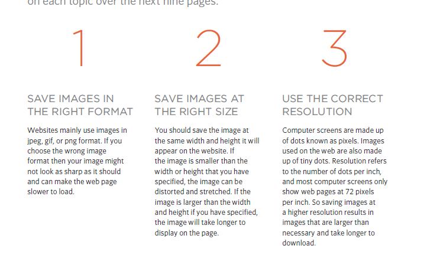
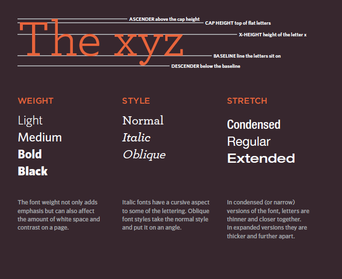
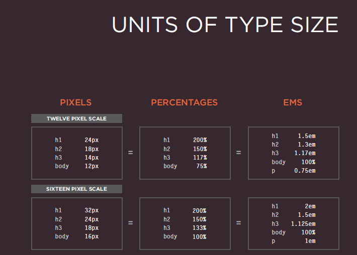

# Css 
# Adding Images
## syntax of adding < img > 

 ## Height & Width of Images
* height This specifies the height of the image in pixels.
* width This specifies the width of the image in pixels.
## Three Rules for Creating Images
 
## Img Formating 
* JPEG 
* GIF

# Imgs Dimintions 
 * Example: If your image is 600 pixels wide and 300 pixels tall,
you can reduce the size of theimage by 50%. Result: This will create an image that is quicker to download.

* Example: If your image is only 100 pixels wide by 50 pixels tall,
increasing the size by 300% would result in poor quality.
Result: The image will look blurry or blocky.
* Example: If your image is 300 pixels square, you can remove
parts of it, but in doing so you might lose valuable information.
Result: Only some images can be cropped and still make sense.

# Image Resolution
Images created for the web should be saved at
a resolution of 72 ppi. The higher the resolution
of the image, the larger the size of the file.

# Fi gure and Figure Caption
 * < figure>
Images often come withcaptions. HTML5 has introduced
a new < figure> element tocontain images and their caption
so that the two are associated.You can have more than one
image inside the < figure> element as long as they all share
the same caption.
 * < figcaption>
The < figcaption> element has been added to HTML5 in order
to allow web page authors to add a caption to an image.
Before these elements were created there was no way to
associate an < img> element with its caption.
 

 # Foreground Color 
* **rgb values**
These express colors in terms of how much red, green and
blue are used to make it up. For example: rgb(100,100,90).

* **hex codes** These are six-digit codes that
represent the amount of red, green and blue in a color, preceded by a pound or hash # sign. For example: #ee3e80
* **color names**
There are 147 predefined color names that are recognized
by browsers. For example: DarkCyan 

# Texts 
The properties that allow you to control
the appearance of text can be split into
two groups:
Those that directly affec
 * the font and its appearance
(including the typeface, whether it is regular, bold or italic,and the size of the text)
* Those that would have the same effect on text no matter
what font you were using (including the color of text and
the spacing between words and letters) 

# Unit of size types 

# Underline & Strike (text-decoration)

* none
This removes any decoration already applied to the text.
* underline
This adds a line underneath the text.
* overline
This adds a line over the top of the text.
* line-through
This adds a line through words.
* blink
This animates the text to make it flash on and off (however this is
generally frowned upon, as it isconsidered rather annoying).

# Alignment
| type | kinds|
|------|------|
|text-align| left , right , center , justify : (text-align : right )|
| Vertical Alignment | Vertical align :baseline sub,super,top,text-top,middle,bottom, text-bottom (vertical-align : left)|

## Drop Shadow
* text-shadow :The text-shadow property has become commonly used despite
lacking support in all browsers. It is used to create a drop
shadow, which is a dark version of the word just behind it and
slightly offset. 

* First Lett er or Line
:first-letter, :first-line

