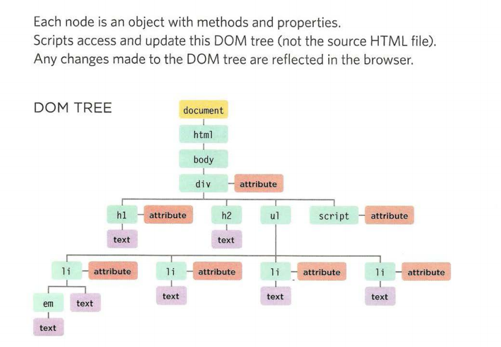

# JavaScript 

## Objests in JavaScript 
Objects group together a set of variables and functions to create a model 
of a something you would recognize from the real world. In an object, 
variables and functions take on new names. 
* IN AN OBJECT: VARIABLES BECOME KNOWN AS *PROPERTIES*
* IN AN OBJECT: FUNCTIONS BECOME KNOWN AS *METHODS*
**syntax of writting Object**

## creating Objects using literal Nation Method :
*literal Nation is the easiest and most popular way to create objects*

**We can access properties or methods of the objects using *dot notation* or *curly brackets***
# Obejects , Documents 

The Document Object Model (DOM) specifies how browsers should create a model of an HTML page and how JavaScript can access and update the 
contents of a web page while it is in the browser window. 

## THE DOM TREE IS A MODEL OF A WEB PAGE 
As a browser loads a web page, it creates a model of that page. 
The model is called a DOM tree, and it is stored in the browsers memory.It consists of four main types of nodes.

# WORKING WITH THE DOM TREE
**Accessing and updating the DOM tree involves two steps:**

 ## STEP 1 : ACCESS THE ELEMENTS 
 1. Select an Individual elememt node : 
 * get El ement Byld ()
 * querySe 1 ector () 
 
 2. SELECT MULTIPLE ELEMENTS (NODELISTS) :
 * getElementsByClassName() 
 * getElementsByTagName() 
 * querySelectorAll() 

 3. TRAVERSING BETWEEN ELEMENT NODES :
 * parentNode
 * previousSibling / nextSibling 
 * firstChild / lastChild 

## 

 

 