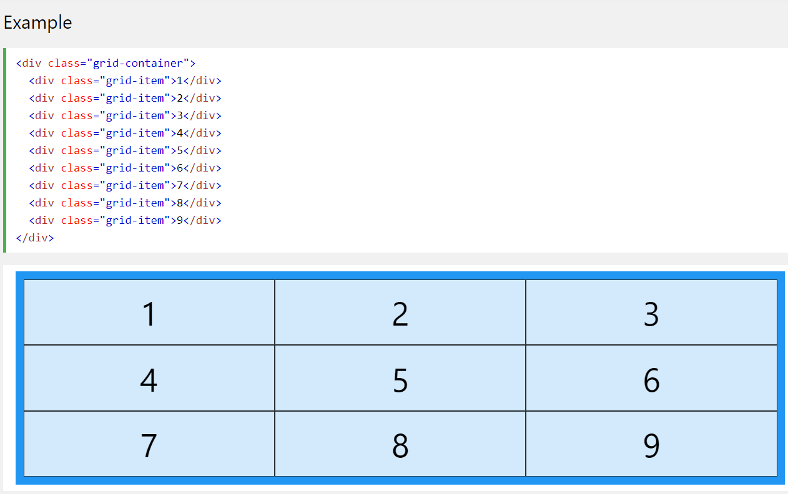
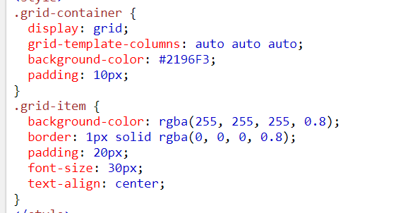
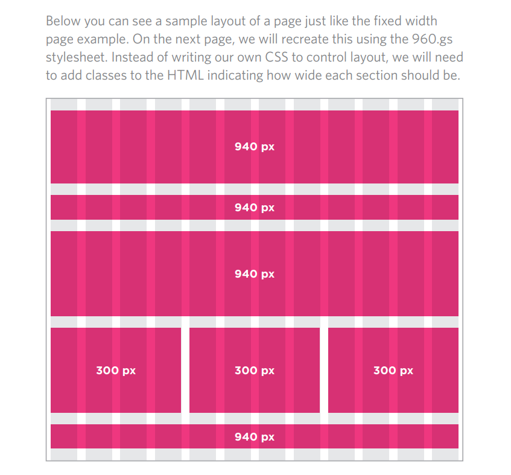

# CSS Layout 
**Controlling the Position of Elements**
|type | role |
|-----|------|
| fixed position | t positions the element in relation to the browser window |
| relative position | shifting it to the top, right, bottom, or left of where it would have been placed |
| Absolute position | positions the element in relation to its containing element.|

# Float 
The float property is used for positioning and formatting content e.g. let an image float left to the text in a container.

The float property can have one of the following values:

* left - The element floats to the left of its container
* right - The element floats to the right of its container 
* none - The element does not float (will be displayed just where it occurs in the text). This is default
* inherit - The element inherits the float value of its parent
In its simplest use, the float property can be used to wrap text around images.

# Screen Resolution
Resolution refers to the number of dots a screen shows per inch. Some 
devices have a higher resolution than desktop computers and most 
operating systems allow users to adjust the resolution of their screens.

 **the higher the resolution, the smaller the text appears.**
  ## Page Sizes
  Because screen sizes and display resolutions vary so much, web 
designers often try to create pages of around 960-1000 pixels wide 
(since most users will be able to see designs this wide on their screens).

# Fixed and Liquid width Layout !
A "fixed-width" layout is one in which the layout of the page is contained within a wrapper that doesn't adjust its size when the width of the browser changes. 
To create a fixed width layout, the width of the main boxes on 
a page will usually be specified in pixels (and sometimes their 
height, too).

Liquid layouts define layout regions that both resize with text, and reflow as needed to accommodate on-screen display.
The liquid layout uses percentages to specify the width 
of each box so that the design will stretch to fit the size of the 
screen.

# Layout Grids
Composition in any visual art (such as design, painting, or photography) 
is the placement or arrangement of visual elements — how they are 
organized on a page. Many designers use a grid structure to help them 
position items on a page, and the same is true for web designers.
 
 * A grid layout consists of a parent element, with one or more child elements.

# CSS Frameworks
A CSS framework is a library allowing for easier, more standards-compliant web design using the Cascading Style Sheets language. ... CSS frameworks offer different modules and tools: reset style sheet. grid especially for responsive web design.

## Using the 960.GS Grid
960.gs provides a style sheet that you can include in your 
HTML pages. Once our page links to this style sheet, you can 
provide the appropriate classes to your HTML code and it will 
create multiple column layouts for you.

