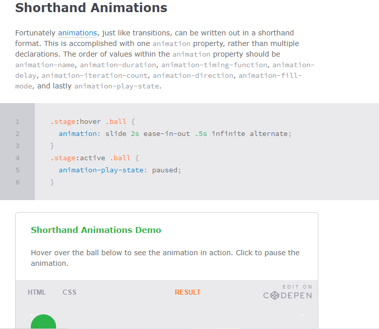

 #  Forms

# Text Input
< input>
The < input> element is used to create several different form 
controls. The value of the typeattribute determines what kind 
of input they will be creating.

* input type = " text"
* input type = " password  "
* input type = " text area "
* iput type =" radio "
* input type = " checkbox"
* input type = " Drop down list box"
* input type = " Multiple Select Box" ... < select>
* iput type =" file "
* input type="submit"
* type="image"
 
 # Table Properties
* Full-Width Table : The table above might seem small in some cases. If you need a table that should span the entire screen (full-width), add width: 100% to the 
< table> element

* Collapse Table Borders : The border-collapse property sets whether the table borders should be collapsed into a single border

width to set the width of the 
table padding to set the space between the border of each table 
cell and its content text-transform to convert the content of the table headers to 
uppercase letter-spacing, font-size to add additional styling to the content of the table headers border-top, border-bottom to set borders above and below 
the table headers text-align to align the writing to the left of some table cells and to the right of the others background-color to change the background color of the alternating table rows :hover to highlight a table row when a user's mouse goes over it.

# Styling Forms
* Styling Text Inputs : font-size sets the size of the text entered by the user.
color sets the text color, and background-color sets the 
background color of the input.border adds a border around 
the edge of the input box, andborder-radius can be used 
to create rounded corners
* Styling Submit Buttons : color is used to change the color of the text on the button.text-shadow can give a 3D look to the text in browsers that 
support this property.border-bottom has been used 
to make the bottom border of the button slightly thicker, which gives it a more 3D feel.background-color can make the submit button stand out from other items around it.
 
 * Styling Fieldsets & Legends : The legend is used to indicate what information is required in the fieldset.
 background-color is used to change the color behind these 
items.border is used to control the appearance of the border around the fieldset and/or legend.border-radius is used to soften the edges of these elements in browsers that support this property.padding can be used to add space inside these elements.

# JavaScript / EVENTS

Scripts often respond to these events by updating the content of the web page (via the Document Object Model) which makes the page feel more interactive. 
* INTERACTIONS EVENTS 
* TRIGGER CODE RESPONDS 
* CREATE EVENTS CODE TO USERS 

# HOW EVENTS TRIGGER JAVASCRIPT CODE 
* Select t he element node(s) you want the script to respond to. 
* Indicate which event on the selected node(s) will trigger the response. 
* State the code you want to run when the event occurs. 
## WAYS TO BIND AN EVENT TO AN ELEMENT
* TRADITIONAL DOM EVENT HANDLERS
HTML DOM events allow JavaScript to register different event handlers on elements in an HTML document.

Events are normally used in combination with functions, and the function will not be executed before the event occurs (such as when a user clicks a button).
