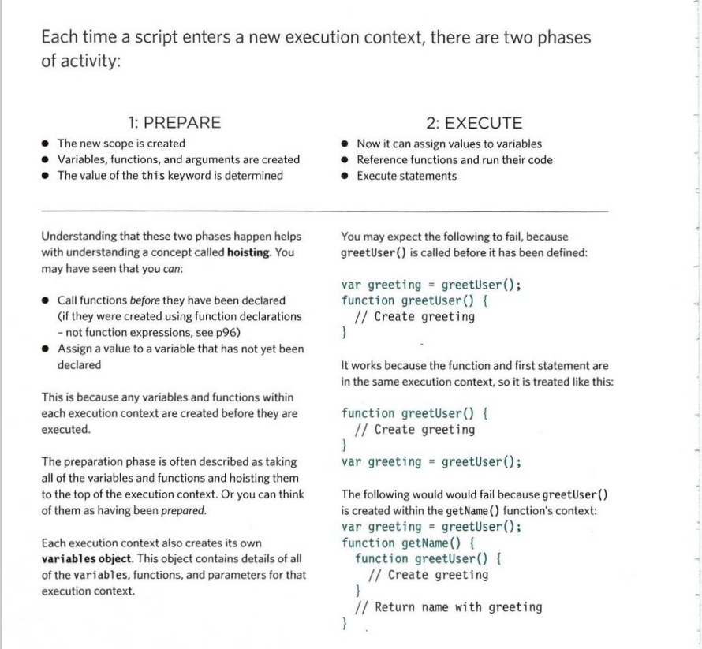
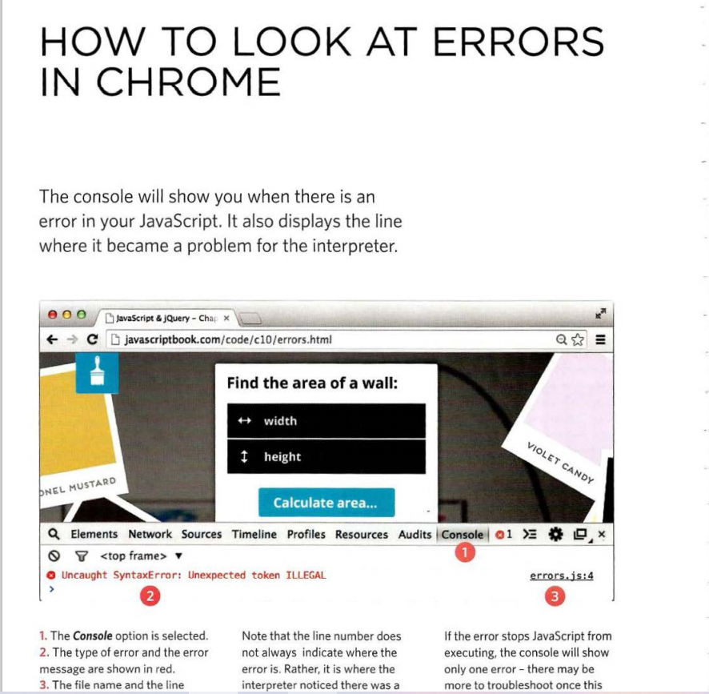
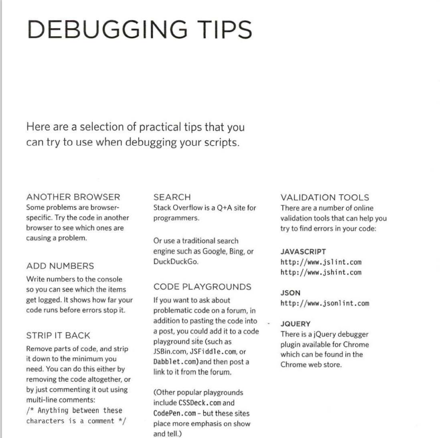

# ERROR HANDLING AND DEBUGGING
JavaScript can be hard to learn and everyone makes 
mistakes when writing it.  how to find the errors in your code. It will also DEAL how to write scripts that deal with potential errors gracefully. 
## ORDER OF EXECUTION
To find the source of an error, it helps to know how scripts are processed. 
The order in which statements are executed can be complex; some tasks 
cannot complete until another statement or function has been run.

# EXECUTION CONTEXT & HOISTING 

* UNDERSTANDING SCOPE
In the interpreter, each execution context has its own va ri ables object. 
It holds the variables, functions, and parameters available within it. 
Each execution context can also access its parent's v a ri ables object.
* UNDERSTANDING ERRORS
If a JavaScript statement generates an error, then it throws an exception. 
At that point, the interpreter stops and looks for exception-handl ing code. 
* ERROR OBJECTS
Error objects can help you find where your mistakes are 
and browsers have tools to help you read them. 

# DEBUGGING TIPS
