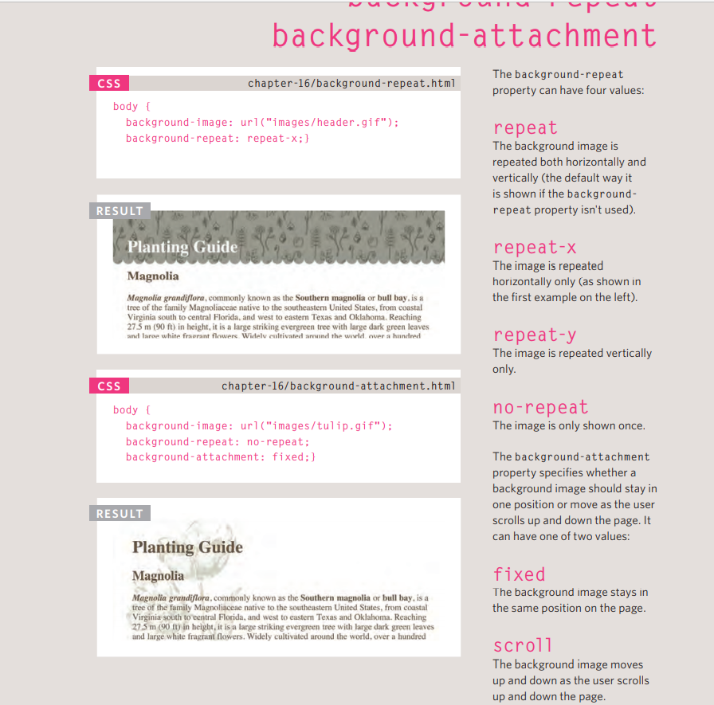
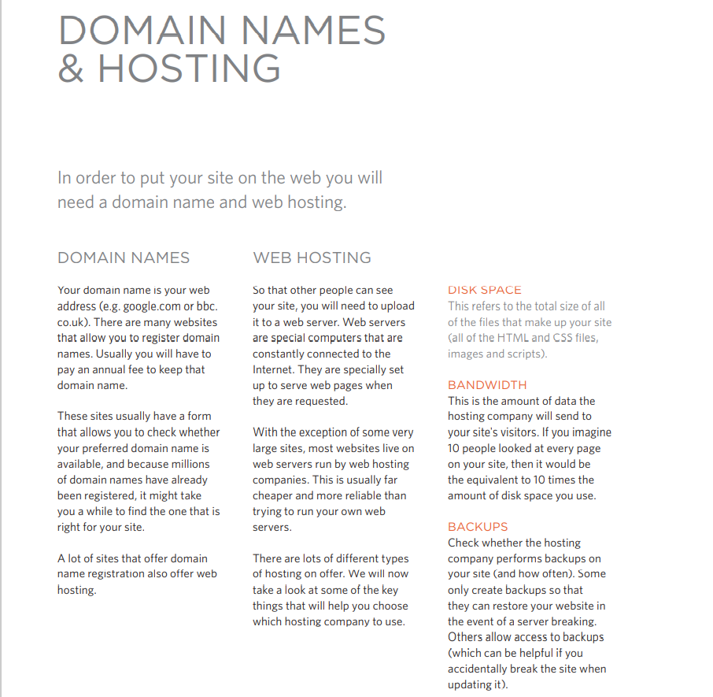

# Images 
* controlling the size of images in css 
You can control the size of an image using the width and 
height properties in CSS, just like you can for any other box. 
* Aligning the images using css :  float property can be used to move an element to the left or the right of its containing block, allowing text to flow around it

* centering images using css  : img.align-center { 
display: block; 
margin: 0px auto;}

* background images : The background-image
property allows you to place an image behind any HTML 
element. This could be the entire page or just part of the page. By 
default, a background image will repeat to fill the entire box.

# Search Engine Optimization (SEO)
SEO is a huge topic and several books have been written on the subject. 
The following pages will help you understand the key concepts so you can 
improve your website's visibility on search engines.

## The Basics 
 is the practice of trying to help your site appear nearer 
the top of search engine results when people look for the topics 
that your website covers.
## On-Page Techniques
On-page techniques are the methods you can use on your 
web pages to improve their rating in search engines.
## OFF-Page Techniques
Getting other sites to link to you is just as important as on-page 
techniques. Search engines help determine how to rank your 
site by looking at the number of other sites that link to yours.

# Analytics: Learning about your Visitors
As soon as people start coming to your site, you can start analyzing 
how they found it, what they were looking at and at what point they are 
leaving. One of the best tools for doing this is a free service offered by 
Google called Google Analytics.
* Signing Up
* How it Works
* The Tracking Code
