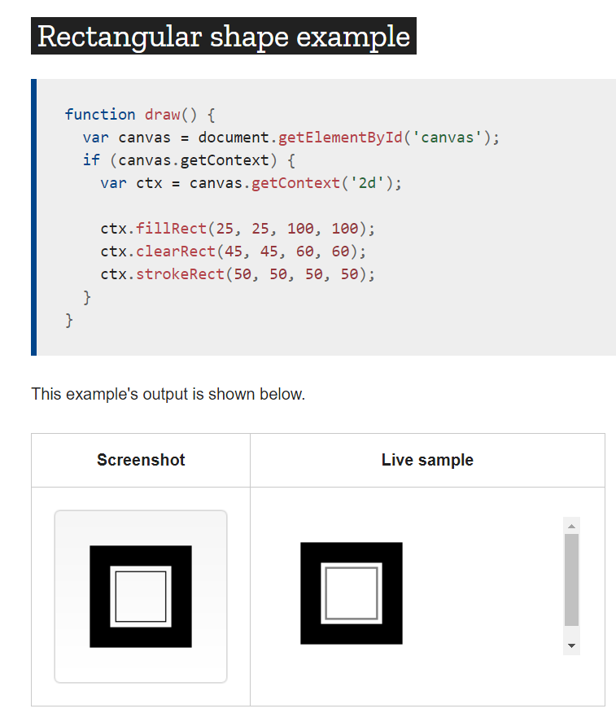
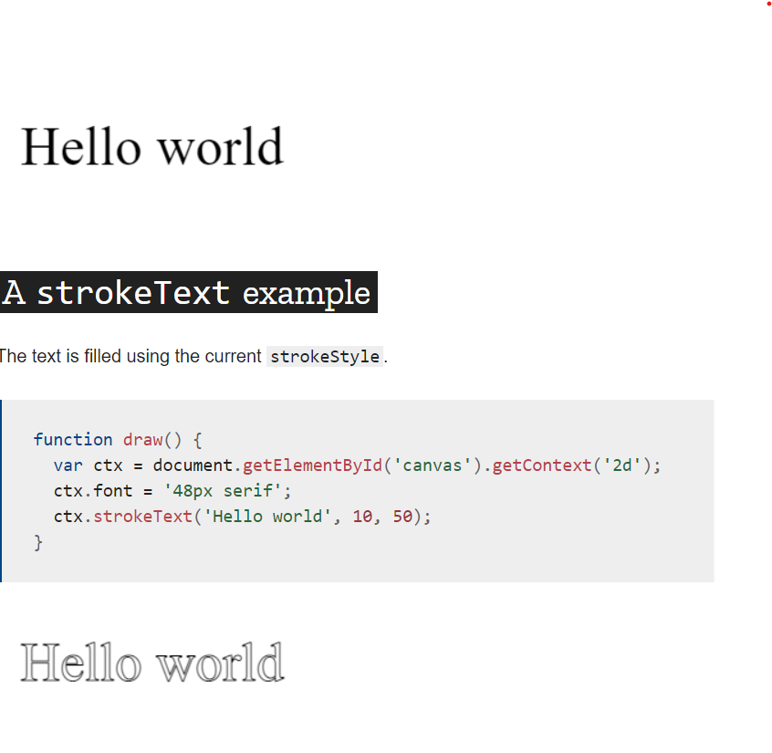

# The < canvas> element

At first sight a < canvas> looks like the < img> element, with the only clear difference being that it doesn't have the src and alt attributes. Indeed, the < canvas> element has only two attributes, width and height. These are both optional and can also be set using DOM properties. When no width and height attributes are specified, the canvas will initially be 300 pixels wide and 150 pixels high. The element can be sized arbitrarily by CSS, but during rendering the image is scaled to fit its layout size: if the CSS sizing doesn't respect the ratio of the initial canvas, it will appear distorted.

# Drawing shapes with canvas

The grid :  Normally 1 unit in the grid corresponds to 1 pixel on the canvas.

# Drawing rectangles
* fillRect(x, y, width, height)
Draws a filled rectangle.

* strokeRect(x, y, width, height)
Draws a rectangular outline.

* clearRect(x, y, width, height)
Clears the specified rectangular area, making it fully transparent.

# Applying styles and colors
## Colors 
* **fillStyle = color**
Sets the style used when filling shapes.
* **strokeStyle = color**
Sets the style for shapes' outlines.

## Fill style
we once again use two for loops to draw a grid of rectangles, each in a different color. The resulting image should look something like the screenshot. There is nothing too spectacular happening here. We use the two variables i and j to generate a unique RGB color for each square, and only modify the red and green values. 

# Drawing text 

# 

* font = value
The current text style being used when drawing text. This string uses the same syntax as the CSS font property. The default font is 10px sans-serif.

* textAlign = value
Text alignment setting. Possible values: start, end, left, right or center. The default value is start.

* textBaseline = value
Baseline alignment setting. Possible values: top, hanging, middle, alphabetic, ideographic, bottom. The default value is alphabetic.

* direction = value
Directionality. Possible values: ltr, rtl, inherit. The default value is inherit.