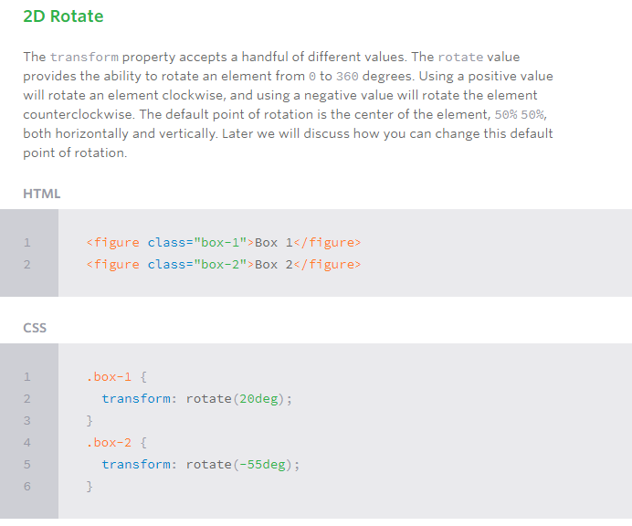
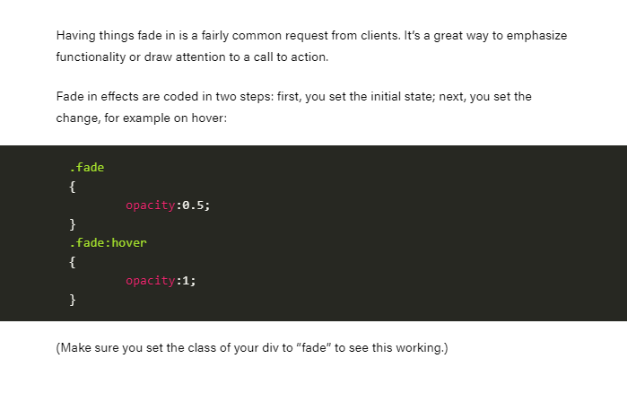
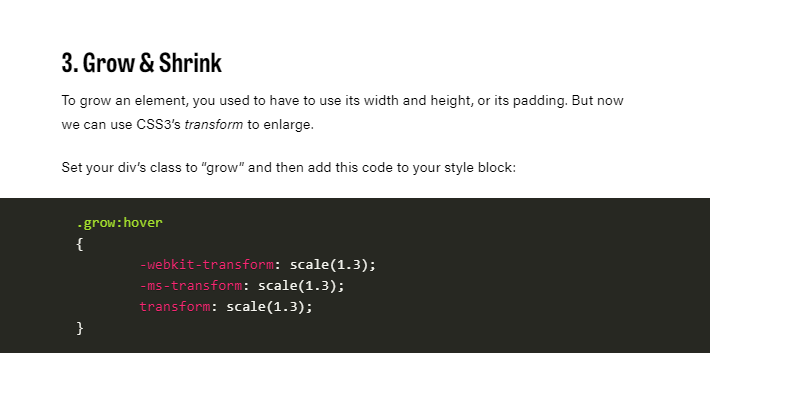

# Transform Syntaxs

The actual syntax for the transform property is quite simple, including the transform property followed by the value. The value specifies the transform type followed by a specific amount inside parentheses.

div {
 *   -webkit-transform: scale(1.5);
 *     -moz-transform: scale(1.5);
 *       -o-transform: scale(1.5);
 *         transform: scale(1.5);
}

 # 2D Rotate 
 

# Combining Transforms

It is common for multiple transforms to be used at once, rotating and scaling the size of an element at the same time for example. In this event multiple transforms can be combined together. To combine transforms, list the transform values within the transform property one after the other without the use of commas.

Using multiple transform declarations will not work, as each declaration will overwrite the one above it. The behavior in that case would be the same as if you were to set the height of an element numerous times.

# Transitions & Animations
In this Lesson8 CSS Transitions
Shorthand Transitions Animations
Customizing Animations Shorthand Animations

 One evolution with CSS3 was the ability to write behaviors for transitions and animations. Front end developers have been asking for the ability to design these interactions within HTML and CSS, without the use of JavaScript or Flash, for years. Now their wish has come true.

With CSS3 transitions you have the potential to alter the appearance and behavior of an element whenever a state change occurs, such as when it is hovered over, focused on, active, or targeted.

Animations within CSS3 allow the appearance and behavior of an element to be altered in multiple keyframes. Transitions provide a change from one state to another, while animations can set multiple points of transition upon different keyframes.

# Shorthand Animations 

# Fade in 

# Grow and Shrink 

Shrinking an element is as simple as growing it. To enlarge an element we specify a value greater than 1, to shrink it, we specify a value less than 1:

.shrink:hover
{
        -webkit-transform: scale(0.8);
        -ms-transform: scale(0.8);
        transform: scale(0.8);
}

# Rotate elements
CSS transforms have a number of different uses, and one of the best is transforming the rotation of an element. Give your div the class “rotate” and add the following to your CSS:

.rotate:hover
{

      *  -webkit-transform: rotateZ(-30deg);

      *  -ms-transform: rotateZ(-30deg);

      *  transform: rotateZ(-30deg);
}

# Inset border
One of the hottest button styles right now is the ghost button; a button with no background and a heavy border. We can of course add a border to an element simply, but that will change the element’s position. We could fix that problem using box sizing, but a far simpler solution is the transition in a border using an inset box shadow.

Give your div the class “border” and add the following CSS to your styles:

.border:hover
{

    * box-shadow: inset 0 0 0 25px #53a7ea;

}