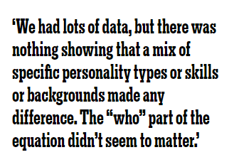

# What Google Learned From Its Quest to Build the Perfect Team
like most 25-year-olds, Julia Rozovsky wasn’t sure what she wanted to do with her life. She had worked at a consulting firm, but it wasn’t a good match. Then she became a researcher for two professors at Harvard, which was interesting but lonely. Maybe a big corporation would be a better fit. Or perhaps a fast-growing start-up. All she knew for certain was that she wanted to find a job that was more social. ‘‘I wanted to be part of a community, part of something people were building together,’’ she told me. She thought about various opportunities — Internet companies, a Ph.D. program — but nothing seemed exactly right. So in 2009, she chose the path that allowed her to put off making a decision: She applied to business schools and was accepted by the Yale School of Management.

When Rozovsky arrived on campus, she was assigned to a study group carefully engineered by the school to foster tight bonds. Study groups have become a rite of passage at M.B.A. programs, a way for students to practice working in teams and a reflection of the increasing demand for employees who can adroitly navigate group dynamics. A worker today might start the morning by collaborating with a team of engineers, then send emails to colleagues marketing a new brand, then jump on a conference call planning an entirely different product line, while also juggling team meetings with accounting and the party-planning committee. To prepare students for that complex world, business schools around the country have revised their curriculums to emphasize team-focused learning.

In Silicon Valley, software engineers are encouraged to work together, in part because studies show that groups tend to innovate faster, see mistakes more quickly and find better solutions to problems. Studies also show that people working in teams tend to achieve better results and report higher job satisfaction. In a 2015 study, executives said that profitability increases when workers are persuaded to collaborate more. Within companies and conglomerates, as well as in government agencies and schools, teams are now the fundamental unit of organization. If a company wants to outstrip its competitors, it needs to influence not only how people work but also how they work together.

Five years ago, Google — one of the most public proselytizers of how studying workers can transform productivity — became focused on building the perfect team. In the last decade, the tech giant has spent untold millions of dollars measuring nearly every aspect of its employees’ lives. Google’s People Operations department has scrutinized everything from how frequently particular people eat together (the most productive employees tend to build larger networks by rotating dining companions) to which traits the best managers share (unsurprisingly, good communication and avoiding micromanaging is critical; more shocking, this was news to many Google managers).

The company’s top executives long believed that building the best teams meant combining the best people. They embraced other bits of conventional wisdom as well, like ‘‘It’s better to put introverts together,’’ said Abeer Dubey, a manager in Google’s People Analytics division, or ‘‘Teams are more effective when everyone is friends away from work.’’ But, Dubey went on, ‘‘it turned out no one had really studied which of those were true.’’